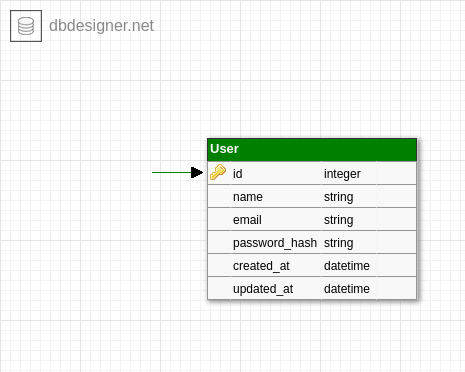

# nodejs-tdd-project
> A simple tdd example with nodejs

This is a session authentication project using [jest](https://github.com/facebook/jest), [sequelize](https://github.com/sequelize/sequelize) and [express](https://github.com/expressjs/express).

## Installation

To install and config the project dependencies, is recommended the [yarn](https://yarnpkg.com/lang/en/) package manager.

```sh
yarn install
```

However, you also can use [npm](https://www.npmjs.com/get-npm).

```sh
npm install
```

## Usage manual

- ### Routes guide

The project contains the current routes:

| Method | Uri        | Functionality                                  | Content-Type |
|--------|------------|------------------------------------------------|--------------|
| POST   | /sessions  | used to add a new [user](src/app/controllers/SessionController.js) data.                   | json         |
| GET    | /dashboard | redirect the authenticated user to the dashboard. | none         |

- ### Authentication

The [authentication](src/app/middlewares/auth.js) is used to set the user token validation, see [User.js](src/app/models/User.js) model file for the token generator methods.

- ### Migrations

For project database migrations information, see the [migrations](src/database/migrations) directory.

## Project estructure

This project was created using the [express framework](https://expressjs.com/) to create the server routes and middlewares:

```bash
└── src
    ├── app
    │   ├── controller
    |   │   └── SessionController.js
    │   └── middlewares
    |       └── auth.js
    ├── app.js
    ├── routes.js
    └── server.js
```

To make the application tests, it was used the [jest framework](https://jestjs.io/):

```bash
├── __tests__
|   ├── coverage
|   ├── integration
|   |   └── session.test.js
|   ├── unit
|   |   └── user.test.js
|   ├── utils
|   |   └── truncate.js
|   ├── database.sqlite
|   └── factories.js
└──jest.config.js
```

For database settings, the [sequelize ORM](https://sequelize.org/) was used in this project:

```bash
├── src
|   └── app
|       ├── models
|       │   └── User.js
|       ├── config
|       │   └── database.js
|       └── database
|           ├── migrations
|           |   └── 20191010142857-create-users.js
|           └── seeders
├── .env
├── .env.test
└── .sequelizerc

```

## Project database

The PostgreSQL Data Base Management System was used to store the application data:



## Meta

Linkedin Profile – [Messias Geovani](https://www.linkedin.com/in/messias-geovani-00125416a?lipi=urn%3Ali%3Apage%3Ad_flagship3_profile_view_base_contact_details%3BGnSoFwiETD%2BtGrv4dF9mSw%3D%3D) 

Email – messias.geovani.lima@gmail.com

Github profile – [messiasGeovani](https://github.com/messiasGeovani)

## Contributing

1. Fork it (<https://github.com/messiasGeovani/nodejs-tdd-project/fork>)
2. Create your feature branch (`git checkout -b feature/fooBar`)
3. Commit your changes (`git commit -am 'Add some fooBar'`)
4. Push to the branch (`git push origin feature/fooBar`)
5. Create a new Pull Request
